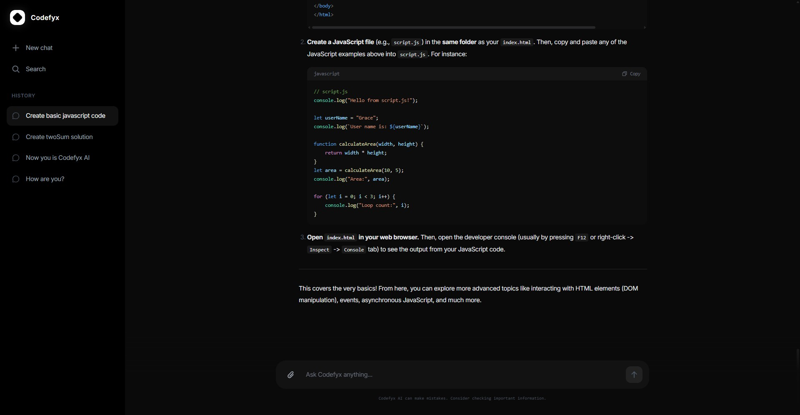

<div align="center">


<br />
<br />


</div>

<br/>

## Codefyx

Codefyx is a modern, high-performance AI chat interface designed for developers and power users. Built with the latest web technologies, it provides a seamless and intuitive environment for interacting with AI models. The project features a minimalist dark-themed design, real-time synchronization, and a robust architecture focused on speed and reliability.

## Preview

<p align="center">
  
</p>

## Features

- **Modern AI Chat Interface:** A sleek, dark-themed UI built with Next.js 15 and Tailwind CSS for a professional look.
- **Real-time Interaction:** Fast and responsive chat experience utilizing React 19 and optimized component rendering.
- **Global Search:** Instant access to your chat history through a powerful and intuitive search modal.
- **Persistent Chat History:** Securely store and retrieve your conversations using a deep integration with Supabase.
- **Rich Media Support:** Comprehensive Markdown rendering with syntax highlighting for various programming languages.
- **Intelligent Navigation:** A dynamic sidebar for managing chat sessions, workspace organization, and quick tools.
- **End-to-End Type Safety:** Fully implemented in TypeScript to ensure a robust, maintainable, and scalable codebase.

## Tech Stack

- **Next.js 15:** The latest features of the React framework for optimized performance and developer experience.
- **React 19:** Utilizing the newest hooks and patterns for efficient UI state management.
- **TypeScript:** Enterprise-grade static typing for enhanced code quality and developer productivity.
- **Tailwind CSS:** A utility-first CSS framework for rapid and consistent UI development.
- **Supabase:** A powerful backend-as-a-service providing real-time database capabilities and authentication.
- **Lucide React & Phosphor Icons:** High-quality icon sets for a consistent and modern visual language.
- **React Markdown:** Robust rendering of markdown content with support for GFM and syntax highlighting.

## Getting Started

To get a local copy of this project up and running, follow these steps.

### Prerequisites

- **Node.js 20.x** or higher.
- **npm** or **yarn**.
- **Supabase Account** for database and environment configuration.

## Installation

### 1. Project Setup

```bash
# Clone the repository
git clone https://github.com/fahmirizalbudi/codefyx.git

# Navigate to the project directory
cd codefyx

# Install dependencies
npm install
```

### 2. Environment Configuration

Create a `.env.local` file in the root directory and add your Supabase credentials:

```env
NEXT_PUBLIC_SUPABASE_URL=your_supabase_url
NEXT_PUBLIC_SUPABASE_ANON_KEY=your_supabase_anon_key
```

### 3. Run the Development Server

```bash
npm run dev
```

Access the application at [http://localhost:3000](http://localhost:3000).

## Documentation

The project follows standard React and Next.js conventions:
- **Components:** Located in `src/components`, following a modular and reusable pattern.
- **API Routes:** Implemented using Next.js App Router in `app/api`.
- **Lib:** Core utilities and service clients (like Supabase) are found in `src/lib`.

## License

All rights reserved. This project is for educational purposes and portfolio demonstration only.
